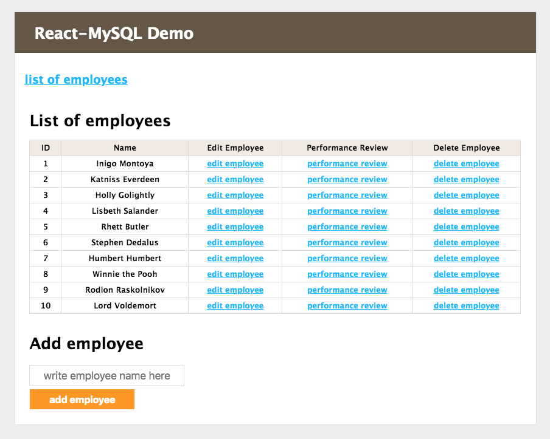

# Full Stack Developer Challenge
## [ React - Node/Express - MySQL ]
*"Design a web application that allows employees to submit feedback toward each other's performance review"*

---

## Description of the application
### Basic structure
The application is a basic employee performance review tool. It has the following functionality:
- List all employees
- Add/remove/update/view employees
- Add/update/view performance reviews

Here is a screenshot of the "Employees" page:

  

### Technology used
- React on the client side
- Node.js/Express on the server side
- MySQL database

## Instructions on installation and running
The code is split into two parts:
- server-side (in the `server` folder)
- client-side (in the `client` folder)
The application needs both the server and the client to run concurrently. In the development environment this is achieved by running the two in separate terminal windows.

### MySQL database
- Import to install on your local machine the MySQL database (included in the clone/download package)
- Alternatively, create a database `react_node` and the following tables in it:

CREATE TABLE `admin` (
  `id` int(11) NOT NULL,
  `name` varchar(30) NOT NULL
) ENGINE=InnoDB DEFAULT CHARSET=utf8;

CREATE TABLE `employees` (
  `id` int(11) NOT NULL,
  `adminId` int(11) NOT NULL,
  `name` varchar(30) NOT NULL
) ENGINE=InnoDB DEFAULT CHARSET=utf8;

CREATE TABLE `performreview` (
  `id` int(11) NOT NULL,
  `refid` int(11) NOT NULL,
  `content` text NOT NULL
) ENGINE=InnoDB DEFAULT CHARSET=utf8;

### Server
- Make sure that in the file 'server/src/endpoints.js' an appropriate socket is specified for the database connection (`const db`). Currently there is the socket for MAMP - `socketPath: '/Applications/MAMP/tmp/mysql/mysql.sock'`
- Change to the `server` directory
- run `npm install` to install dependencies
- run `npm start` to run the server at http://localhost:3001

### Client
- Change to the `client` directory
- run `npm install` to install dependencies
- run `npm start` to run the client at http://localhost:3000
